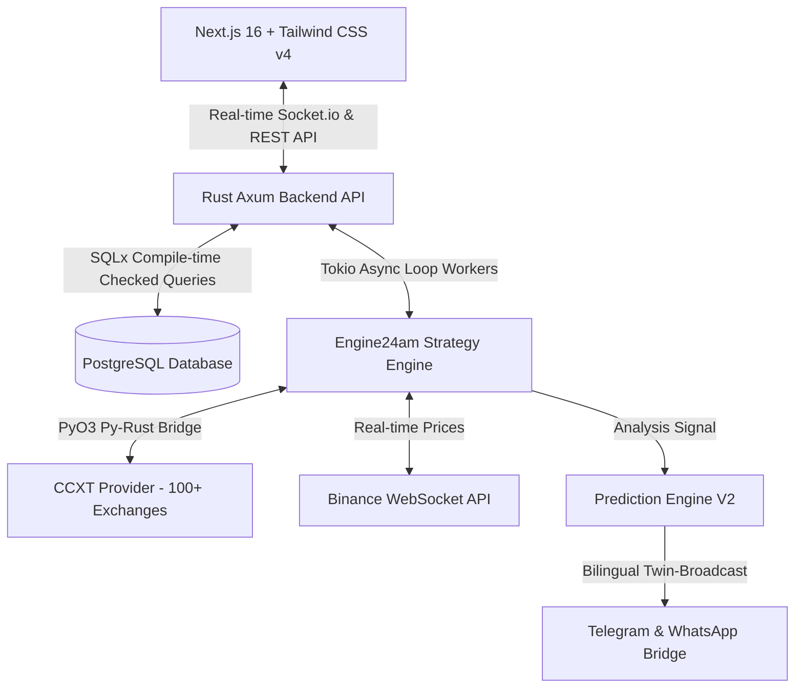

# 🚀 TRADINGSAFE: NEXT-GENERATION ALGORITHMIC TRADING ENGINE
## Dokumen Pembaruan & Fitur Utama (Marketing & Launch Deck)

> [!NOTE]
> Dokumen ini memuat rangkuman teknis komprehensif, fitur terbaru, dan arsitektur visioner dari proyek **TradingSafe (BotTrade)** sebagai materi referensi pemasaran utama menjelang peluncuran resmi.

---

## 1. 🌌 Visi & Pitch Eksekutif: Masa Depan Trading Kripto Otonom
Dalam industri perdagangan aset digital yang dinamis dan beroperasi 24/7/365, kecepatan, presisi matematis, dan keandalan sistem adalah batas antara profitabilitas dan risiko. **TradingSafe** hadir bukan sekadar sebagai bot perdagangan biasa, melainkan sebagai **Infrastruktur Perdagangan Otonom Berkinerja Tinggi (High-Performance Autonomous Trading Infrastructure)**. 

Menggabungkan ketangguhan sistem backend berbasis bahasa pemrograman **Rust**, kecerdasan analisis kuantitatif berkecepatan tinggi, dan filosofi antarmuka pengguna kelas dunia bergaya **Apple**, TradingSafe dirancang untuk menjembatani antara algoritma institusional dengan kenyamanan pengguna ritel. Kami menghilangkan kompleksitas teknis dan menghadirkan eksekusi tanpa celah langsung ke genggaman Anda.

---

## 2. ⚡ Arsitektur Teknologi Tingkat Tinggi (The Core Tech Stack)
Di balik antarmuka yang indah, TradingSafe didukung oleh kombinasi teknologi terbaik di kelasnya untuk menjamin stabilitas 24/7, latensi ultra-rendah, dan keamanan maksimal:

*   **Frontend Premium**: Menggunakan **Next.js 16 (Turbopack)** dengan **Tailwind CSS v4** untuk rendering instan, responsivitas tinggi, dan efisiensi memori yang optimal di berbagai perangkat.
*   **Backend Tangguh (Rust - Axum)**: Web framework berbasis Rust dengan performa tinggi yang mengelola routing API, audit data, dan autentikasi JWT + enkripsi Bcrypt.
*   **Engine Trading 24 Jam (Engine24am)**: Runtime asinkron menggunakan **Tokio** untuk menjalankan ribuan worker perdagangan (bot) secara paralel tanpa overhead memori.
*   **Analisis Data Kilat (Polars)**: Integrasi perpustakaan analisis data tercepat (Polars) untuk pemrosesan indikator teknikal tingkat lanjut.
*   **Konektivitas Bursa Global (CCXT & WebSocket)**: Jembatan modular (CCXT) untuk mengakses lebih dari 100+ exchange kripto global (Binance, Bybit, Indodax, dll.) secara aman dengan validasi kunci API terenkripsi dalam *Security Vault*.
*   **Presisi Finansial Mutlak (`rust_decimal`)**: Menghilangkan kesalahan pembulatan angka desimal (floating-point error) dengan akurasi hingga 28 angka di belakang koma untuk menjamin keamanan dana pengguna.
*   **Sinkronisasi Tipe Data (TS-RS)**: Autogenerasi tipe data TypeScript langsung dari skema data Rust demi memastikan keharmonisan kode antara frontend dan backend tanpa celah bug tipe data.

---

## 3. 🎨 Pembaruan Desain & UX Antarmuka: Apple-Vibe Premium Layout (Selesai 100%)
Antarmuka pengguna TradingSafe telah didesain ulang sepenuhnya mengikuti filosofi **Apple Human Interface Guidelines (HIG)** dengan estetika minimalis modern 2026:

*   **Desain Edge-to-Edge & Tanpa Celah**: Seluruh metrik, grafik, dan panel kontrol memanfaatkan 100% lebar viewport. Padding luar dikurangi untuk memberikan ruang napas maksimal bagi data perdagangan real-time (*above the fold*).
*   **Hapus Clutter Kartu Boxy (Flat Line Border Design)**: Struktur data tidak lagi menggunakan kotak-kotak solid yang kaku, melainkan dipisahkan oleh garis tipis transparan (`border-white/10`) yang sangat elegan di atas latar belakang gelap mewah, menonjolkan fokus penuh pada data nyata.
*   **Sistem Tema Dual-Mode Terang/Gelap yang Mulus**: Tombol toggle instan (Matahari & Bulan) yang terintegrasi di dalam dropdown profil dengan penyimpanan status di `localStorage`, mencegah terjadinya kedipan visual (*flicker*) saat halaman dimuat ulang.
*   **Collapsible Navigation Sidebar**: Sidebar desktop dapat menyusut secara elegan dari `w-56` ke status tersembunyi penuh `w-0` (`opacity-0`) guna memperluas ruang analisis grafik teknis.
*   **Desain Kontrol Kokpit Mengurangi Beban Kognitif**: Konfigurasi bot strategis yang kompleks dipecah menjadi langkah-langkah ringkas berbasis tab terstruktur (**CORE**, **LOGIC**, **RISK & RUN**). Ini menghindari kelelahan informasi (*cognitive overload*) pada pengguna.
*   **Interaksi Taktil & Radius Sudut Premium**: Semua elemen tombol interaktif, selector, dan kolom input menggunakan radius sudut tipis yang sedikit melengkung (`rounded-[6px]`), dikombinasikan dengan bayangan *neumorphic* taktil ganda untuk memberi kesan fisik yang nyata saat ditekan.
*   **Apple-Vibe Expanding Footer**: Footer minimalis yang secara bawaan hanya menampilkan baris hak cipta tipis, namun dapat digeser ke bawah (expand) secara interaktif untuk memunculkan detail pusat kontak, tautan penting, dan kolom buletin.

---

## 4. 🧠 Pusat Otomatisasi Sinyal Canggih: Auto-Analysis & WhatsApp/Telegram Prediction Engine V2
TradingSafe dilengkapi dengan layanan mikro otonom berdurasi 24 jam yang terus memantau dinamika pasar dan membagikan analisisnya secara instan:

*   **Pemantauan 24/7 Multi-Timeframe**: Menghubungkan WebSocket real-time langsung ke Binance untuk memantau 5 aset kripto berkapitalisasi pasar terbesar (BTC, ETH, SOL, BNB, XRP) di 4 timeframe sekaligus (5m, 15m, 1h, 1d).
*   **Bilingual Twin-Broadcast**: Mesin secara dinamis menghasilkan laporan analisis ganda dalam versi Bahasa Indonesia dan Bahasa Inggris untuk segmen pemirsa global secara real-time.
*   **Layanan Mikro Prediksi V2 (Prediction-V2 Engine)**:
    *   **Pendeteksian Tren Ganda**: Mendukung pendeteksian pola tren naik (**BULLISH CALL**) maupun tren turun (**BEARISH CALL**) menggunakan kombinasi EMA (50) & RSI (14).
    *   **Format Desimal Dinamis Spesifik Koin**: Koin berharga rendah (seperti XRP) secara cerdas diformat menggunakan 4 angka desimal (contoh: Entry: $1.2435, TP: $1.2497) agar target harga tidak tumpang tindih akibat pembulatan. Koin utama tetap menggunakan format 2 desimal standar.
    *   **Sistem Balasan Berantai Transparan (Threaded Quoted Reply)**: Robot menyimpan ID pesan prediksi awal di WhatsApp & Telegram. Ketika target tercapai, batal, atau waktu habis, robot otomatis membalas (*quote/reply*) pesan prediksi awal tersebut sehingga riwayat pengiriman transparan dan teratur.
    *   **Anti-Spam Cooldown & Cooldown Tenang**: Untuk menjaga kredibilitas dan kebersihan informasi grup, robot menerapkan masa tenang paksa selama 15 menit setelah siklus prediksi selesai (Target Hit, Stop Loss, atau Timeout) sebelum prediksi baru pada koin yang sama dapat dipicu kembali.
    *   **Buku Besar Log Persisten**: Setiap riwayat prediksi direkam otomatis ke dalam log terstruktur di `/root/bottrade/logs/prediction_history.json`.

---

## 5. 🤖 Matriks Bot & Strategi Perdagangan yang Didukung
Pengguna dapat memilih dan menyesuaikan berbagai varian bot perdagangan yang siap dijalankan sesuai kondisi pasar:

| Nama Bot / Strategi | Tingkat Kemudahan | Keunggulan Strategis | Fitur Utama |
| :--- | :--- | :--- | :--- |
| **DCA Lite (Martingale Standard)** | Pemula / Menengah | Menurunkan rata-rata harga beli saat pasar terkoreksi. | Pembelian bertahap, Martingale multiplier sederhana. |
| **DCA Pro (Professional Martingale)** | Profesional | Manajemen risiko tingkat lanjut dengan efisiensi modal. | Safety Orders, Leverage Selector, Trailing Take Profit. |
| **Grid Master (Spot Grid)** | Pemula / Menengah | Mengambil keuntungan dari pergerakan harga menyamping (*sideways*). | Batas kisi (Grid) statis, eksekusi beli rendah jual tinggi otomatis. |
| **Hybrid DCA/Grid Combo** | Profesional | Menggabungkan kelebihan DCA saat tren turun dan grid saat konsolidasi. | Take Profit Dinamis, penyesuaian parameter otomatis. |
| **Trailing Stop Tracker** | Menengah | Memaksimalkan profit dari koin yang sedang berada dalam tren naik kuat (*bullish rally*). | Pengejaran harga tertinggi secara dinamis, stop loss bergeser ke atas. |
| **BB Momentum Entry** | Profesional | Memanfaatkan volatilitas tinggi saat terjadi breakout harga. | Entri posisi otomatis berdasarkan indikator Bollinger Bands. |
| **EMA Cross Trend Follower** | Menengah / Tinggi | Menangkap awal tren baru jangka menengah hingga panjang. | Deteksi Golden Cross dan Death Cross secara real-time. |
| **RSI Momentum Oscillator** | Menengah | Memanfaatkan kejenuhan pasar untuk posisi beli/jual cepat. | Deteksi area Oversold (Beli) dan Overbought (Jual). |

---

## 6. 📊 Fitur Backtesting & Lab Simulasi Terpadu
Sebelum menerjunkan modal nyata ke pasar, TradingSafe menyediakan **Lab Simulasi** berkinerja tinggi:
*   **Backtest Instan Tanpa Polling**: Memanfaatkan data historis (*kline*) yang tersimpan dalam database lokal untuk mensimulasikan ratusan transaksi dalam hitungan detik.
*   **Metrik Kinerja Transparan**: Menyajikan laporan detail mencakup Total PnL (Persentase & Nominal), Win Rate (Rasio Kemenangan), Max Drawdown, dan daftar seluruh log transaksi transaksi beli/jual secara transparan.
*   **Penyelarasan Strategi Kustom**: Pengguna dapat menyimpan racikan konfigurasi strategi kustom ke database (`Save User Strategy`) untuk dipasang pada portofolio bot mereka di masa mendatang.

---

## 7. 🔮 Visi Pemasaran Sebelum Peluncuran (Launch Marketing Positioning)
Dalam kampanye peluncuran, TradingSafe diposisikan dengan tiga pilar kekuatan utama:
1.  **"Rust-Powered Execution"**: Penekanan pada keandalan sistem yang tahan uji, latensi mendekati nol, bebas kesalahan pembulatan matematika, dan kesiapan operasional 24/7.
2.  **"Apple-Vibe UI/UX Splendor"**: Menghilangkan visual dashboard trading yang kuno, padat ikon membingungkan, dan berantakan. TradingSafe menghadirkan antarmuka ultra-bersih, elegan, modern, dan nyaman dipandang mata untuk waktu lama.
3.  **"Transparent AI Broadcaster V2"**: Akses langsung ke sinyal berkualitas yang dikirim ke komunitas melalui integrasi WhatsApp & Telegram yang bebas spam, dilengkapi sistem pembuktian transparansi berantai (*quoted replies*).

---
*Dokumen ini dirancang dan dikelola secara otonom oleh Antigravity AI untuk mendukung peluncuran komersial TradingSafe di tahun 2026.*
